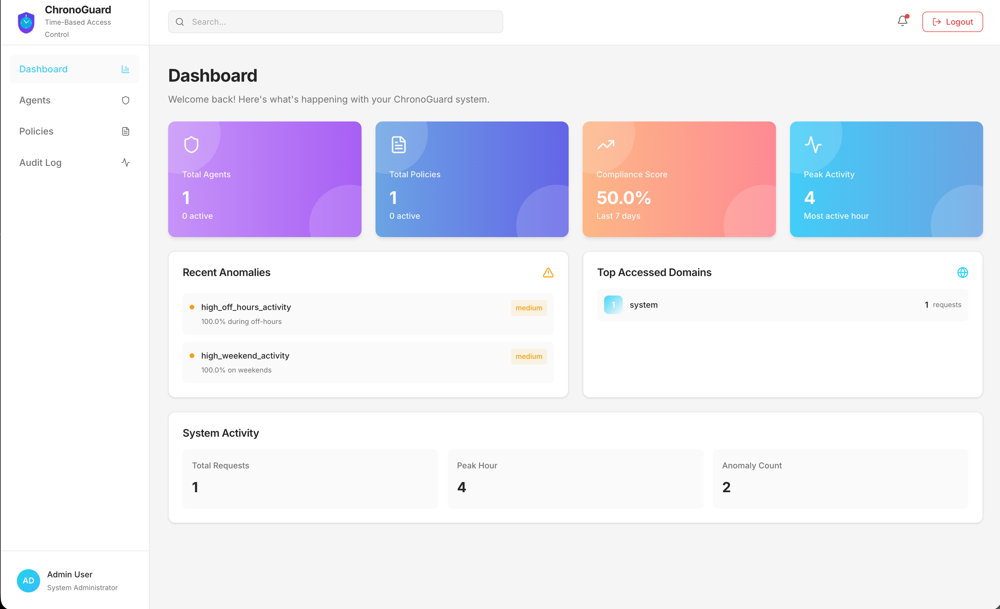
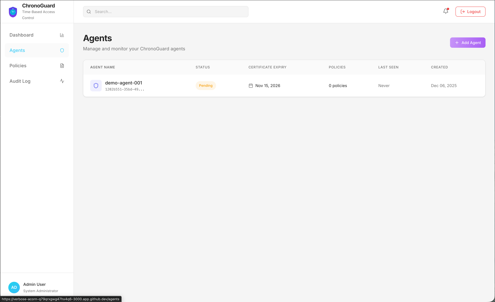
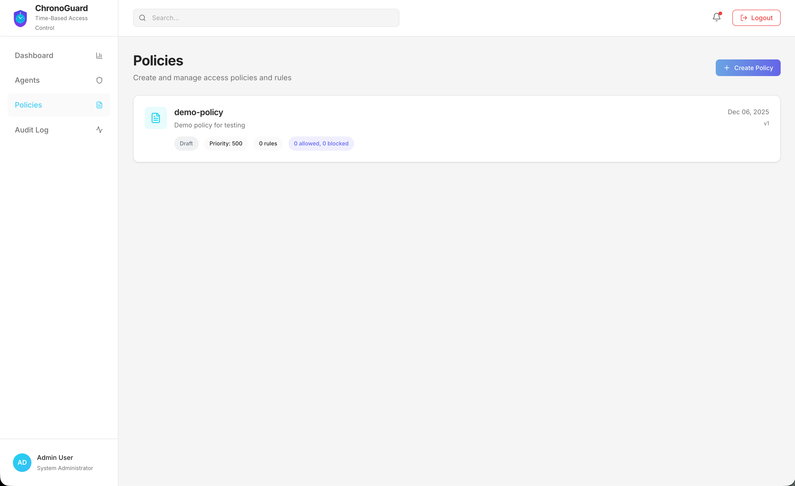
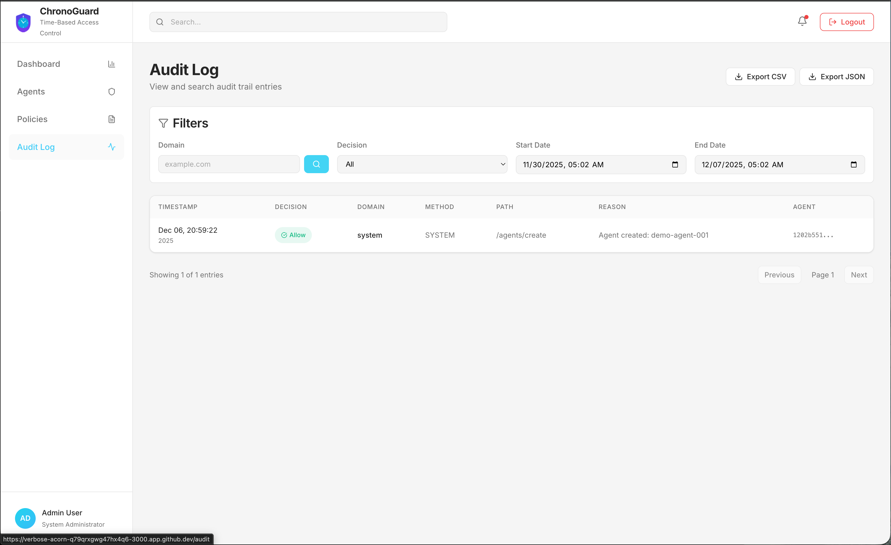

<div align="center">
  

# ChronoGuard

**Zero-trust proxy for browser automation with temporal controls**

[](LICENSE)
[](https://www.python.org/downloads/)
[](backend/tests)

---

## 🚀 Live Demo

**Experience ChronoGuard instantly - No installation required.**

[](https://j-raghavan.github.io/ChronoGuard/)

> **Zero-Install Simulation**: This demo runs entirely in your browser using a simulated backend. You can create agents, define policies, and watch live audit traffic generation immediately.

---

## 🚀 See Value in 5 Minutes (Codespaces)

**No installation. No configuration. Just click and experience ChronoGuard.**

[](https://codespaces.new/j-raghavan/ChronoGuard?quickstart=1)

> **One click** launches a fully configured environment with all 6 services running.
> The dashboard auto-opens at port 3000 - you're ready to explore immediately.

---

## 📸 What You'll Experience

### 1. Real-Time Dashboard Overview

Get instant visibility into your entire browser automation infrastructure at a glance.



**What you see:**
- **Total Agents & Policies** - Track registered agents and active policies
- **Compliance Score** - Real-time compliance monitoring (last 7 days)
- **Peak Activity** - Identify your busiest automation hours
- **Recent Anomalies** - Instant alerts for off-hours or weekend activity
- **Top Accessed Domains** - Know where your agents are going

---

### 2. Agent Management

Register, monitor, and control all your browser automation agents from one place.



**What you see:**
- **Agent Registry** - All agents with unique identifiers and mTLS certificates
- **Status Tracking** - Active, Pending, or Suspended states
- **Certificate Expiry** - Never miss a certificate renewal
- **Policy Assignment** - See which policies govern each agent
- **Activity Monitoring** - Last seen timestamps for all agents

---

### 3. Policy Configuration

Create fine-grained access control policies with domain allowlists and time windows.



**What you see:**
- **Policy Builder** - Create policies with priority-based rule evaluation
- **Domain Controls** - Allowed and blocked domain counts at a glance
- **Version Tracking** - Policy versioning for audit compliance
- **Draft/Active States** - Test policies before deployment

---

### 4. Immutable Audit Logs

Every request is logged with cryptographic verification - know WHERE and WHEN your agents go.



**What you see:**
- **Complete Audit Trail** - Every request with timestamp, domain, method, and path
- **Decision Tracking** - Allow/Deny decisions with reasons
- **Flexible Filtering** - Search by domain, decision type, or date range
- **Export Options** - Download as CSV or JSON for compliance reporting
- **Agent Attribution** - Full traceability to the originating agent

---

## 🎮 Try the Demo

Once your Codespace is ready, run these commands to see ChronoGuard in action:

```bash
# 1. Watch a request get BLOCKED ❌
python playground/demo-blocked.py

# 2. Watch a request get ALLOWED ✅
python playground/demo-allowed.py

# 3. View live audit logs 📊
python playground/demo-interactive.py
```

**Then explore:**

- 🎨 **Dashboard** at `http://localhost:3000` (auto-opens)
- 📚 **API Documentation** at `http://localhost:8000/docs`
- 📋 **Real-time audit logs** with cryptographic verification

---

</div>

## Overview

ChronoGuard is an open-source zero-trust proxy that provides network-enforced authorization for browser automation through a mandatory forward proxy. It controls all egress traffic from centralized agent infrastructure (CI/CD, Kubernetes, VM fleets) and provides temporal visibility into automation activities.

**Core value proposition:** _"Know not just WHERE your automation goes, but WHEN - with network-enforced controls that can't be bypassed."_

### Key Features

#### ✅ Implemented (MVP v0.1.0)

- **Zero-Trust Network Enforcement** - Envoy forward proxy with mTLS for agent authentication
- **Policy-Based Access Control** - OPA integration with domain allowlists/blocklists and time windows
- **Immutable Audit Logs** - Hash-chained audit trail with cryptographic verification
- **Temporal Analytics** - Time-series queries for access patterns and compliance reporting
- **OPA Decision Log Ingestion** - Automatic audit entry creation from policy evaluations
- **Multi-Tenancy** - Tenant isolation at database and API layers
- **Docker Deployment** - Complete 6-service stack with docker-compose
- **Web Dashboard** - React-based UI for monitoring and management
- **RESTful API** - FastAPI with OpenAPI documentation

#### 📋 Planned (Post-MVP)

- **Real-Time Monitoring** - WebSocket-based event streaming
- **gRPC Server** - High-performance service-to-service communication
- **Advanced Rate Limiting** - Redis-backed token bucket with burst control
- **Dynamic Proxy Configuration** - Envoy xDS for auto-scaling deployments
- **Policy Versioning** - Rollback and audit history for policy changes
- **Kubernetes Support** - Helm charts and manifests for cloud deployment

### Target Use Cases

- E-commerce intelligence and competitive analysis
- Fintech research and market monitoring
- Healthcare data operations with compliance requirements
- Quality assurance and testing providers
- Any organization running browser agents in controlled infrastructure with compliance obligations

## Quick Start

### Prerequisites

- Docker and Docker Compose
- Git

### Production-Like Deployment

```bash
# 1. Clone the repository
git clone https://github.com/j-raghavan/chronoguard.git
cd chronoguard

# 2. Generate secure secrets (interactive)
./scripts/generate_secrets.sh

# OR manually configure environment
# cp .env.example .env
# Edit .env and set the 3 REQUIRED variables:
# - CHRONOGUARD_DB_PASSWORD
# - CHRONOGUARD_SECURITY_SECRET_KEY
# - CHRONOGUARD_INTERNAL_SECRET
# See .env.example for detailed instructions

# 3. Start the complete stack (all 6 services)
docker compose up -d

# 4. Access the dashboard
# http://localhost:3000

# 5. Access the API documentation
# http://localhost:8000/docs

# 6. Check service health
docker compose ps
```

### Local Development Setup

```bash
# Clone the repository
git clone https://github.com/j-raghavan/chronoguard.git
cd chronoguard

# Install dependencies (requires Python 3.11+ and Poetry)
make install

# Run quality checks (linting, type checking, tests)
make pre-commit

# Start infrastructure services only
docker compose up -d postgres redis chronoguard-policy-engine

# Run the backend server locally
make run-backend

# Run the frontend dashboard locally (in another terminal)
make run-frontend
```

### Loading Sample Data (Development/Demo Only)

Use the CLI to populate sample data:

```bash
# Demo mode must be enabled in .env first
poetry run python backend/scripts/seed_sample_data.py
```

The command aborts if the database already contains agents to prevent accidental overwrites.

**Security Note:** Sample data seeding requires demo mode to be enabled. See [Deployment Security Guide](docs/DEPLOYMENT_SECURITY.md) for production setup.

### Running Tests

```bash
# Run unit tests with coverage
cd backend
PYTHONPATH=backend/src poetry run pytest backend/tests/unit/ -v

# Check test coverage
PYTHONPATH=backend/src poetry run pytest backend/tests/unit/ \
  --cov=backend/src --cov-report=term-missing

# Generate HTML coverage report
PYTHONPATH=backend/src poetry run pytest backend/tests/unit/ \
  --cov=backend/src --cov-report=html
open htmlcov/index.html

# Run integration tests (requires Docker)
PYTHONPATH=backend/src poetry run pytest backend/tests/integration/ -v
```

## Architecture

ChronoGuard follows **Domain-Driven Design (DDD)** with **Clean Architecture** principles and implements **CQRS** (Command Query Responsibility Segregation) for clear separation of concerns.

### High-Level Architecture

```
┌────────────────────┐     ┌────────────────────┐     ┌────────────────┐
│  Browser Agents    │────▶│   ChronoGuard      │────▶│   Internet     │
│  - Playwright      │     │   Proxy (Envoy)    │     │                │
│  - Puppeteer       │     │   + OPA + Time     │     │                │
│  - Selenium        │     │   Enforcement      │     │                │
└────────────────────┘     └────────────────────┘     └────────────────┘
                                    │
                            ┌───────▼────────┐
                            │  Chronological │
                            │   Audit Logs   │
                            │  (TimescaleDB) │
                            └────────────────┘
```

### Core Components (6 Services)

ChronoGuard consists of 6 main services that work together:

1. **Envoy Proxy** (Port 8080) - mTLS forward proxy for agents
2. **OPA Policy Engine** (Port 8181/9192) - Policy evaluation with ext_authz
3. **FastAPI Backend** (Port 8000) - Core API and business logic
4. **React Dashboard** (Port 3000) - Web UI for monitoring
5. **PostgreSQL + TimescaleDB** (Port 5432) - Data persistence
6. **Redis** (Port 6379) - Caching and rate limiting

### Request Flow

```
Agent → Envoy (mTLS) → OPA (ext_authz) → Target Domain
                           ↓
                     FastAPI (decision logs) → PostgreSQL (audit trail)
```

For detailed architecture documentation, see:

- [Architecture Overview](docs/architecture/architecture-overview.md) - High-level design and patterns
- [Detailed Architecture](docs/architecture/architecture.md) - In-depth technical specifications
- [Architecture Diagrams](docs/architecture/architecture-diagrams.md) - Visual representations
- [Architecture Index](docs/architecture/architecture-index.md) - Component reference

### How Agents Use the Proxy

Browser automation agents (Playwright, Puppeteer, Selenium, etc.) connect to ChronoGuard's forward proxy to gain zero-trust access control and audit logging capabilities.

#### 1. Agent Certificate Setup

Each agent needs a unique mTLS certificate for authentication:

```bash
# Generate agent certificate (example)
./scripts/generate-agent-cert.sh agent-name

# This creates:
# - agent-cert.pem (client certificate)
# - agent-key.pem (private key)
# - ca-cert.pem (CA certificate for verification)
```

#### 2. Configure Browser Agent

**Playwright Example:**

```javascript
const { chromium } = require("playwright");

const browser = await chromium.launch({
  proxy: {
    server: "https://chronoguard-proxy:8080",
  },
  // mTLS certificate configuration
  clientCertificates: [
    {
      origin: "https://chronoguard-proxy:8080",
      certPath: "./certs/agent-cert.pem",
      keyPath: "./certs/agent-key.pem",
    },
  ],
});
```

**Puppeteer Example:**

```javascript
const puppeteer = require("puppeteer");

const browser = await puppeteer.launch({
  args: [
    "--proxy-server=https://chronoguard-proxy:8080",
    "--client-certificate=./certs/agent-cert.pem",
    "--client-certificate-key=./certs/agent-key.pem",
  ],
});
```

**Selenium Example (Python):**

```python
from selenium import webdriver
from selenium.webdriver.common.proxy import Proxy, ProxyType

proxy = Proxy()
proxy.proxy_type = ProxyType.MANUAL
proxy.http_proxy = "chronoguard-proxy:8080"
proxy.ssl_proxy = "chronoguard-proxy:8080"

options = webdriver.ChromeOptions()
options.Proxy = proxy
options.add_argument(f'--client-certificate=./certs/agent-cert.pem')

driver = webdriver.Chrome(options=options)
```

#### 3. Policy Assignment

Once an agent is registered, assign it a policy via the API or dashboard:

```bash
# Create a policy
curl -X POST http://localhost:8000/api/v1/policies \
  -H "Content-Type: application/json" \
  -d '{
    "name": "research-policy",
    "description": "Allow research domains only",
    "allowed_domains": ["scholar.google.com", "arxiv.org", "*.edu"],
    "blocked_domains": ["social-media.com"],
    "priority": 100
  }'

# Assign policy to agent (via dashboard or API)
```

#### 4. Access Control Flow

When the agent makes a request:

1. **Agent → Proxy**: HTTPS request with mTLS certificate
2. **Proxy → OPA**: Policy evaluation (domain, time, rate limits)
3. **OPA → Proxy**: Allow/Deny decision
4. **OPA → FastAPI**: Decision log (async)
5. **FastAPI → PostgreSQL**: Immutable audit entry
6. **Proxy → Target**: Forward request if allowed, or block with 403

Every request is logged in the audit trail with cryptographic hash chaining for tamper detection.

## Code Structure

```
ChronoGuard/
├── backend/               # Python backend application
│   ├── src/               # Source code
│   │   ├── presentation/  # Presentation layer
│   │   │   ├── api/       # FastAPI REST routes
│   │   │   ├── grpc/      # gRPC services
│   │   │   └── websocket/ # WebSocket handlers
│   │   ├── application/   # CQRS commands and queries
│   │   ├── domain/        # Domain entities, services, repositories
│   │   ├── infrastructure/# External integrations (OPA, Envoy, persistence)
│   │   └── core/          # Cross-cutting concerns (config, logging, DI)
│   └── tests/             # Test suite
│       ├── unit/          # Unit tests (95%+ coverage)
│       └── integration/   # Integration tests
├── frontend/              # React + TypeScript dashboard
│   └── src/
│       ├── components/    # React components
│       ├── pages/         # Page components
│       ├── services/      # API clients
│       ├── hooks/         # Custom React hooks
│       ├── types/         # TypeScript type definitions
│       └── lib/           # Utilities and helpers
├── sdk/                   # Client SDKs
│   ├── python/            # Python SDK for agent integration
│   ├── javascript/        # JavaScript/TypeScript SDK
│   └── go/                # Go SDK
├── configs/               # Configuration templates
│   ├── envoy/             # Envoy proxy configurations
│   ├── opa/               # OPA policy templates
│   └── nginx/             # Nginx configurations
├── deployments/           # Deployment manifests
│   ├── docker/            # Docker Compose files
│   ├── kubernetes/        # Kubernetes manifests
│   └── helm/              # Helm charts
├── docker/                # Dockerfiles for various services
├── scripts/               # Development and deployment scripts
└── docs/                  # Documentation
    ├── architecture/      # Architecture documentation
    ├── api/               # API documentation
    ├── guides/            # User guides
    ├── project/           # Project management docs
    └── testing/           # Testing documentation
```

## Development Workflow

### Code Quality Standards

ChronoGuard maintains strict code quality standards:

- **95%+ Test Coverage** - All code must have comprehensive test coverage
- **Type Safety** - Full type hints with mypy validation
- **Code Formatting** - Ruff formatter (Black-compatible) for consistent style
- **Linting** - Ruff for fast, comprehensive linting and import sorting
- **Security** - Bandit for security issue detection

See [CODING_GUIDELINES.md](CODING_GUIDELINES.md) for detailed standards.

## Development

### Code Quality Standards

All code contributions must meet these standards:

```bash
# Code formatting and linting (Ruff)
cd backend
poetry run ruff check src/ tests/          # Linting + import sorting
poetry run ruff format src/ tests/         # Code formatting (Black-compatible)

# Type checking (mypy)
poetry run mypy src/

# Security scanning (bandit)
poetry run bandit -r src/ -c pyproject.toml

# Run all quality checks at once
make quality
```

### Test Coverage Requirements

ChronoGuard maintains **96%+ test coverage** on all code:

```bash
# Check current coverage
cd backend
PYTHONPATH=backend/src poetry run pytest backend/tests/unit/ \
  --cov=backend/src \
  --cov-report=term-missing \
  --cov-report=json

# View coverage summary
cat coverage.json | jq '.totals.percent_covered'
# Should show: 96%+
```

### Development Workflow

```bash
# 1. Create a feature branch
git checkout -b feature/my-feature

# 2. Make your changes

# 3. Run quality checks
cd backend
poetry run ruff check src/
poetry run mypy src/
poetry run black src/

# 4. Run tests and verify coverage
PYTHONPATH=backend/src poetry run pytest backend/tests/unit/ \
  --cov=backend/src --cov-report=term-missing

# 5. Commit changes (coverage must be 95%+)
git add .
git commit -m "feat: description of changes"

# 6. Push and create PR
git push origin feature/my-feature
```

## Contributing

We welcome contributions! ChronoGuard is an open-source project under the Apache 2.0 license.

### How to Contribute

1. **Fork the repository** on GitHub
2. **Create a feature branch** (`git checkout -b feature/amazing-feature`)
3. **Follow coding standards** - Run `make pre-commit` before committing
4. **Write tests** - Maintain 95%+ coverage
5. **Commit your changes** (`git commit -m 'Add amazing feature'`)
6. **Push to the branch** (`git push origin feature/amazing-feature`)
7. **Open a Pull Request**

### Pull Request Guidelines

- Ensure all tests pass and coverage remains at 95%+
- Follow the [coding guidelines](CODING_GUIDELINES.md)
- Update documentation as needed
- Include descriptive commit messages
- Reference any related issues

### Development Setup

See the [Quick Start](#quick-start) section for local development setup.

## Documentation

- **[docs/architecture/](docs/architecture/)** - Architecture documentation
- **[docs/testing/](docs/testing/)** - Testing documentation
- **[docs/guides/](docs/guides/)** - User guides

## API Documentation

The ChronoGuard REST API is documented with OpenAPI (Swagger):

- **API Docs (Swagger UI)**: http://localhost:8000/docs
- **API Schema**: http://localhost:8000/openapi.json

## Monitoring and Observability

ChronoGuard provides comprehensive monitoring capabilities:

- **Prometheus Metrics**: http://localhost:8000/metrics
- **Health Check**: http://localhost:8000/health
- **Real-Time Events**: WebSocket endpoint at ws://localhost:8000/ws/v1/events
- **Distributed Tracing**: OpenTelemetry integration (optional Jaeger backend)
- **Structured Logging**: JSON format with correlation IDs

## Troubleshooting

### Common Issues and Solutions

#### Services Not Starting

**Problem**: `docker compose up` fails with port conflicts

**Solution**:

```bash
# Check if ports are already in use
lsof -i :8080  # Envoy proxy
lsof -i :8181  # OPA
lsof -i :8000  # FastAPI
lsof -i :3000  # Dashboard
lsof -i :5432  # PostgreSQL
lsof -i :6379  # Redis

# Stop conflicting services or change ports in docker-compose.yml
```

**Problem**: Database connection errors

**Solution**:

```bash
# Ensure PostgreSQL is healthy
docker compose ps postgres

# Check logs for errors
docker compose logs postgres

# Reset database if needed
docker compose down -v  # WARNING: Deletes all data
docker compose up -d
```

#### Agent Connection Issues

**Problem**: Agent gets "SSL handshake failed" or "certificate verification failed"

**Solution**:

- Verify agent certificate is valid and not expired
- Check that certificate was signed by the same CA as the Envoy server certificate
- Ensure proxy URL uses HTTPS protocol: `https://chronoguard-proxy:8080`
- Check Envoy logs: `docker compose logs chronoguard-proxy`

**Problem**: Agent requests get 403 Forbidden

**Solution**:

```bash
# Check OPA policy evaluation
curl http://localhost:8181/v1/data/chronoguard/authz/allow \
  -H "Content-Type: application/json" \
  -d '{"input": {"attributes": {"source": {"principal": "agent-id"}, "request": {"http": {"host": "example.com"}}}}}'

# Verify policy assignment
curl http://localhost:8000/api/v1/agents/{agent-id}

# Check audit logs for deny reasons
curl http://localhost:8000/api/v1/audit?agent_id={agent-id}&limit=10
```

#### OPA Policy Issues

**Problem**: Policy changes not taking effect

**Solution**:

```bash
# Verify policy was deployed to OPA
curl http://localhost:8181/v1/policies

# Redeploy policy manually
curl -X PUT http://localhost:8181/v1/policies/policy_{policy-id} \
  --data-binary @policy.rego

# Check OPA decision logs
docker compose logs chronoguard-policy-engine | grep decision
```

**Problem**: OPA returns errors in decision logs

**Solution**:

- Check Rego syntax: `docker run --rm -v $(pwd)/configs/opa/policies:/policies openpolicyagent/opa check /policies/*.rego`
- Verify policy data is loaded: `curl http://localhost:8181/v1/data/policies`
- Review OPA logs: `docker compose logs chronoguard-policy-engine`

#### Coverage/Testing Issues

**Problem**: Tests fail with "coverage below 95%" error

**Solution**:

```bash
# Run coverage report to see missing lines
make test-coverage

# Open HTML report to identify gaps
open htmlcov/index.html

# Add tests for uncovered code paths
```

**Problem**: Integration tests fail with connection errors

**Solution**:

```bash
# Ensure test services are running
docker compose -f backend/tests/integration/docker-compose.test.yml up -d

# Wait for services to be healthy
sleep 10

# Run integration tests
make test-integration

# Clean up test services
docker compose -f backend/tests/integration/docker-compose.test.yml down
```

#### Performance Issues

**Problem**: High latency on proxy requests

**Solution**:

- Check OPA policy evaluation time: Look for `evaluation_time_ns` in decision logs
- Enable OPA caching for frequently evaluated policies
- Optimize Rego policies to reduce complexity
- Scale OPA horizontally if needed

**Problem**: Database query slow

**Solution**:

```bash
# Check PostgreSQL performance
docker compose exec postgres psql -U chronoguard -d chronoguard -c "\
  SELECT query, mean_exec_time, calls \
  FROM pg_stat_statements \
  ORDER BY mean_exec_time DESC \
  LIMIT 10;"

# Add indexes if needed (consult docs/database/indexing.md)
```

### Getting Help

If you encounter issues not covered here:

1. **Check Logs**: `docker compose logs [service-name]`
2. **Review Docs**: See [documentation](#documentation) section
3. **Search Issues**: https://github.com/j-raghavan/ChronoGuard/issues
4. **Create Issue**: https://github.com/j-raghavan/ChronoGuard/issues/new
5. **Contact Support**: See [Support](#support) section

## Security

### Reporting Security Issues

If you discover a security vulnerability, please report it through [GitHub Security Advisories](https://github.com/j-raghavan/chronoguard/security/advisories/new). This allows us to handle the issue privately before public disclosure.

**Do not create public GitHub issues for security vulnerabilities.**

### Security Features

- mTLS authentication for agent identity verification
- Cryptographic hash chains for audit log integrity
- Multi-tenant isolation with tenant-scoped queries
- Policy-based access control via OPA
- Rate limiting and domain restrictions
- Certificate expiry tracking and validation

## License

ChronoGuard is licensed under the [Apache License 2.0](LICENSE).

## Support

- **Documentation**: [docs/](docs/)
- **Issues**: [GitHub Issues](https://github.com/j-raghavan/chronoguard/issues)
- **Discussions**: [GitHub Discussions](https://github.com/j-raghavan/chronoguard/discussions)

## Roadmap

### Version 0.1.0 - MVP (Complete ✅)

**Released:** 2025-11-08

- ✅ Core domain models with clean architecture
- ✅ PostgreSQL + TimescaleDB persistence
- ✅ OPA policy engine integration
- ✅ Envoy forward proxy with mTLS
- ✅ OPA decision log ingestion
- ✅ Policy compilation and deployment
- ✅ Audit side effects for operations
- ✅ Docker Compose deployment
- ✅ Integration test infrastructure
- ✅ 96%+ test coverage maintained
- ✅ Web dashboard (React + Vite)
- ✅ RESTful API (FastAPI)

### Version 0.2.0 - Enhanced Features (Planned)

**Target:** Q2 2025

- 📋 gRPC server with streaming support
- 📋 WebSocket event streaming for real-time updates
- 📋 Advanced rate limiting with Redis
- 📋 Dynamic Envoy configuration (xDS)
- 📋 Multi-tenancy hardening
- 📋 Policy versioning and rollback
- 📋 Enhanced monitoring dashboards
- 📋 Performance optimization

### Version 0.3.0 - Production Scale (Planned)

**Target:** Q3 2025

- 📋 Kubernetes deployment manifests
- 📋 Horizontal scaling support
- 📋 High-availability configuration
- 📋 Enhanced observability (Jaeger, Grafana)
- 📋 Security hardening
- 📋 Load testing and benchmarks

## Acknowledgments

ChronoGuard is built with:

- [FastAPI](https://fastapi.tiangolo.com/) - Modern Python web framework
- [Envoy Proxy](https://www.envoyproxy.io/) - High-performance proxy
- [Open Policy Agent](https://www.openpolicyagent.org/) - Policy engine
- [PostgreSQL](https://www.postgresql.org/) + [TimescaleDB](https://www.timescale.com/) - Time-series database
- [React](https://reactjs.org/) - Frontend framework

---

**Built with ❤️ for the browser automation community**
